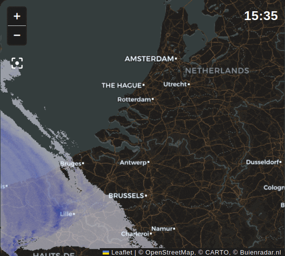

# `ha-map-card` for Korea Radar from Buienradar plugin



## Installation
Install [ha-map-card](https://github.com/hwajin-me/ha-map-card-korea-radar) version `v1.13.0` or above.
Then, install the plugin using one of these options:

#### HACS

[](https://my.home-assistant.io/redirect/hacs_repository/?owner=hwajin-me&repository=ha-map-card-korea-radar&category=plugin)

#### Manual
Copy `ha-map-card-korea-radar.js` to the `www` folder of your Home Assistance configuration.

Note: with a manual installation, the `url` in the configuration should be `/local/ha-map-card-korea-radar.js`

## Configuration
Add the [ha-map-card](https://github.com/hwajin-me/ha-map-card-korea-radar/) custom card to your Home Assistant dashboard.

Use the following configuration as example:
```yaml
type: custom:map-card
x: 37.5490248
"y": 127.0705509
zoom: 7
plugins:
  - name: korea-radar 
    url: >-
      /local/community/ha-map-card-korea-radar/ha-map-card-korea-radar.js
    options:
      delay: 1
      range:
        start:
          entity: input_datetime.dashboard_select_datetime
          attribute: state
      opacity: 0.5
      decorate: <div>{date}</div>
```
